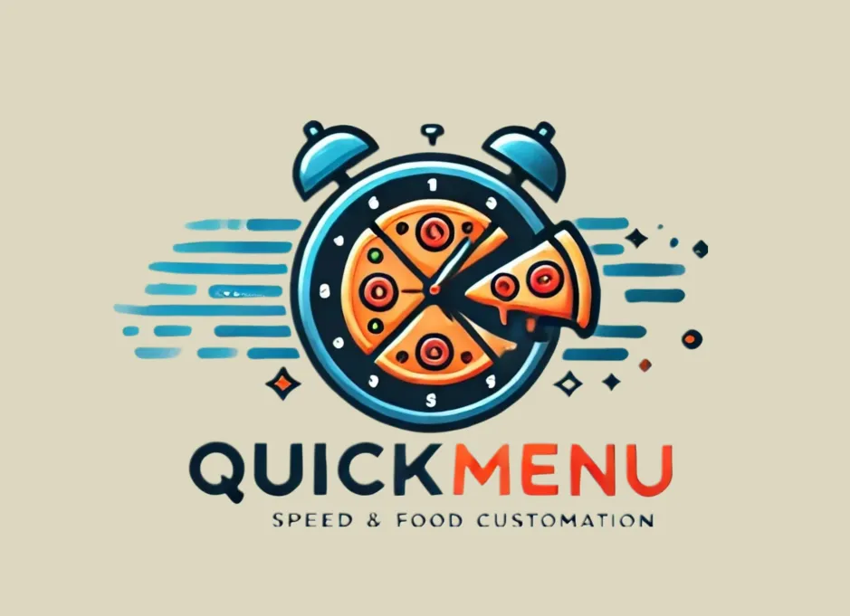

  

# 🚩QuickMenu

QuickMenu was developed as a school project, with the primary goal of helping restaurants create their menus more easily. This project is simple and was built by a small team of two collaborators.

If you have any suggestions or would like to contribute to the project, feel free to make a contribution.

# Technologies:

# Developed by:
[@antonniovic]()
[@DaniloGames]()